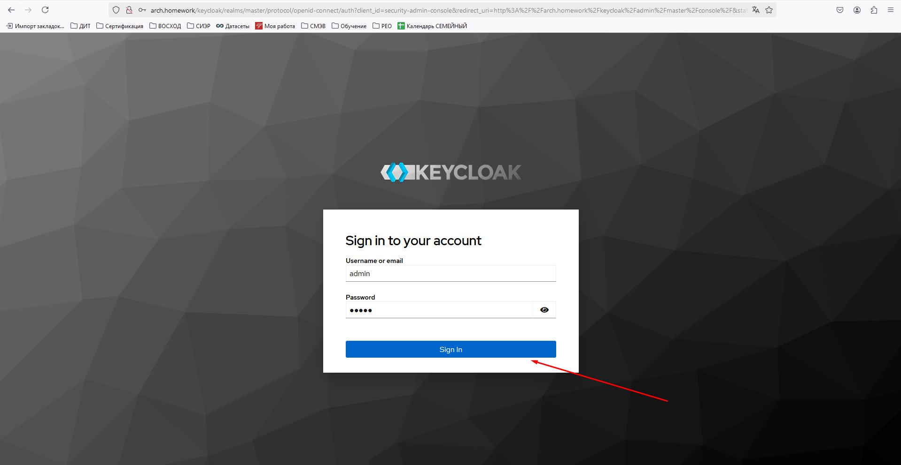
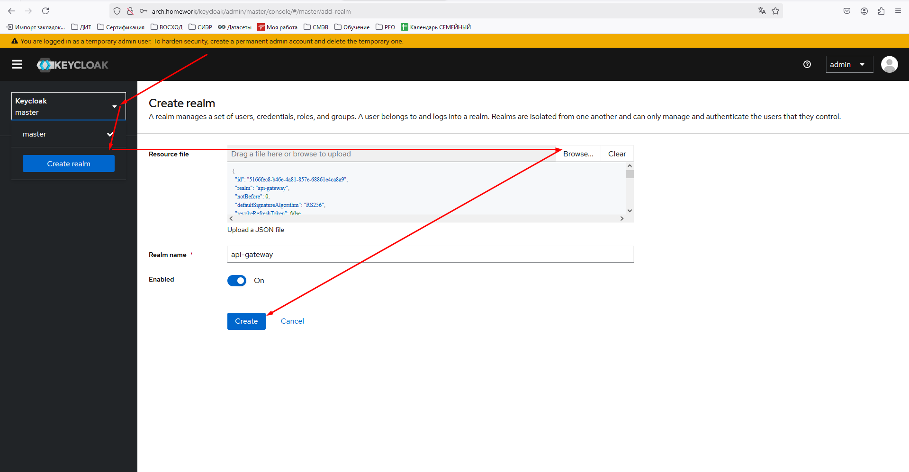
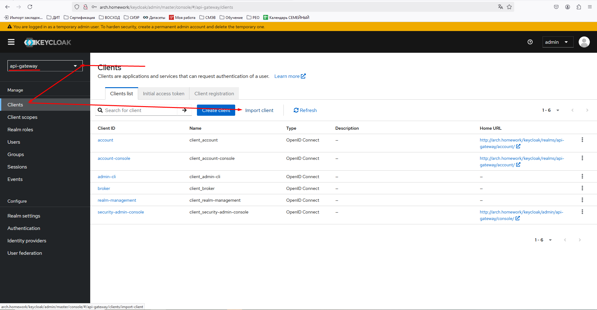
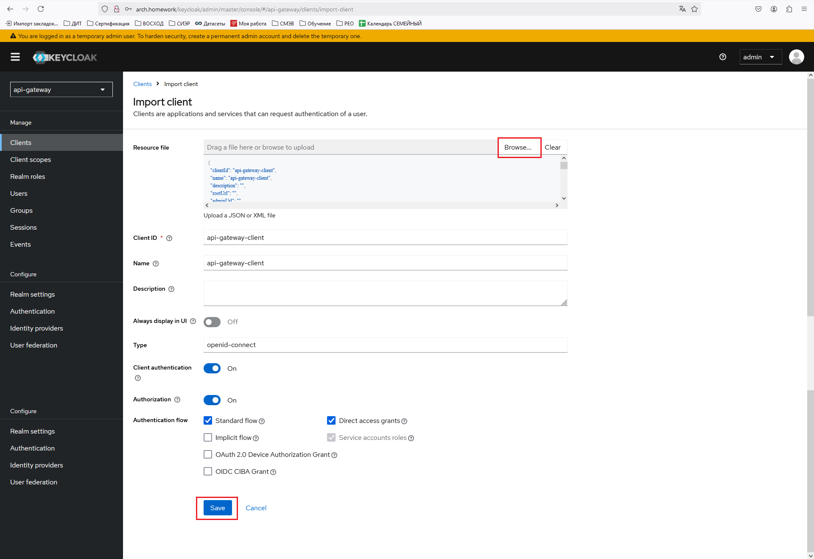
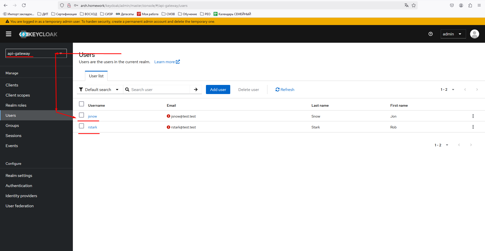
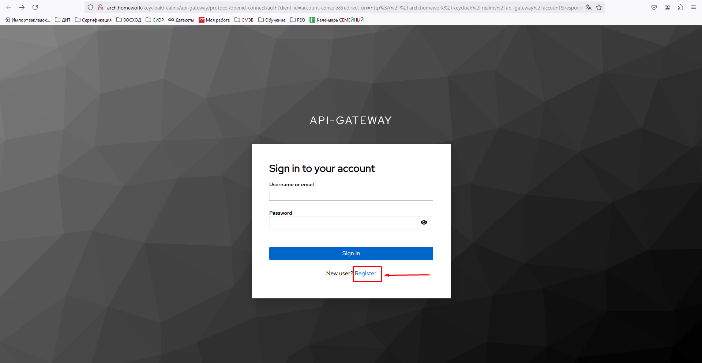
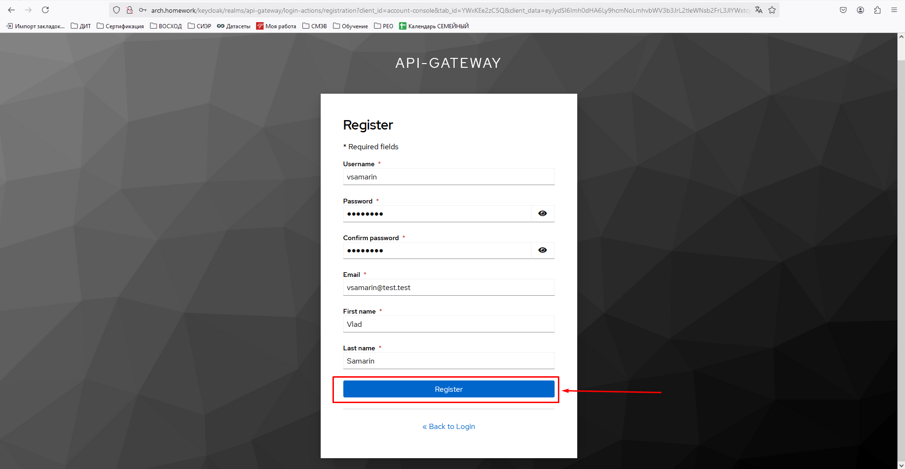
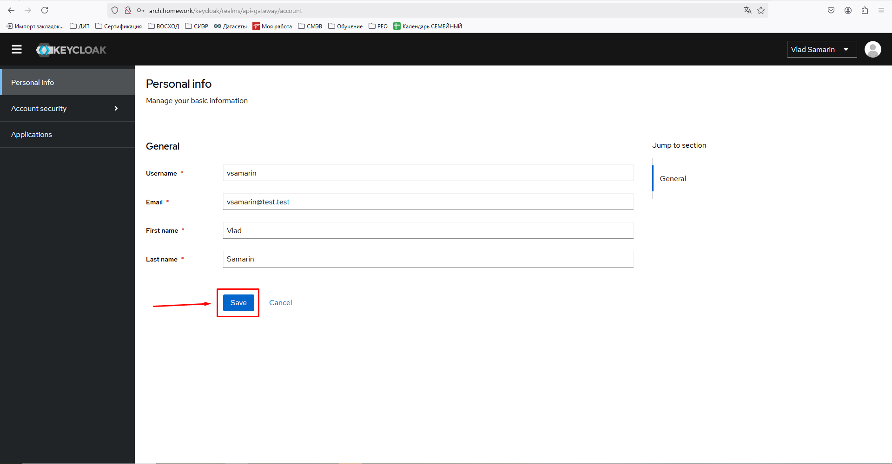
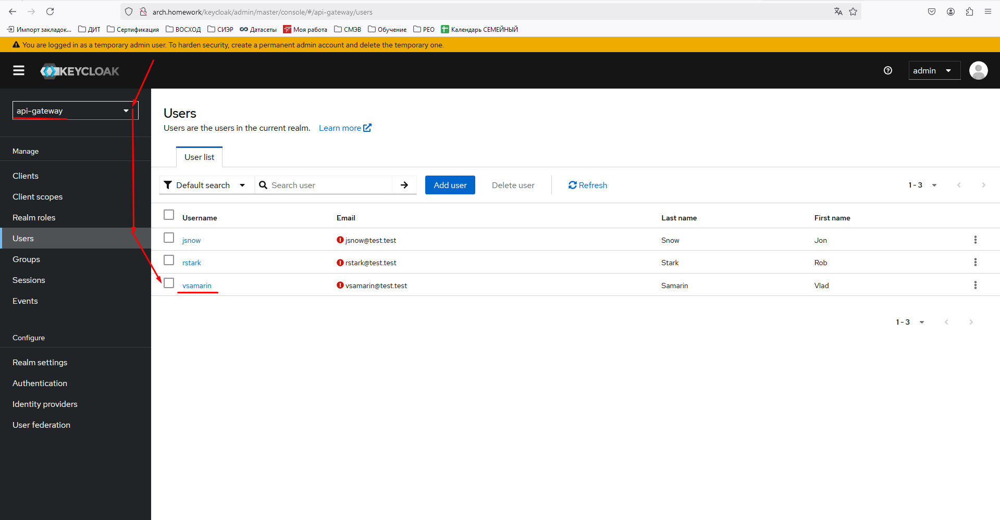

# Install Keycloak

```shell
kubectl apply -f ./keycloak/deployment.yaml
```

```shell
kubectl apply -f ./keycloak/ingress.yaml
```

___

# Configure Keycloak

Open in Browser:
[http://arch.homework/keycloak/](http://arch.homework/keycloak/)

Sign in user admin|admin


Import Realm from file __[api-gateway-realm.json](./import/api-gateway-realm.json)__:


Import Client from file __[api-gateway-client.json](./import/api-gateway-client.json)__:


You don't need to fill or change any settings just click "Save":


Imported realm __api-gateway__ has two preconfigured users: __jsnow|jsnow__ and __rstark|rstark__:


You could register your own user go to this url:
[http://arch.homework/keycloak/realms/api-gateway/account](http://arch.homework/keycloak/realms/api-gateway/account)
and click __Register__ button:


You have to fill the registration form and click __register__:


Click __save__ button:


Go to __[http://arch.homework/keycloak/admin/master/console/](http://arch.homework/keycloak/admin/master/console/)__ and
check that user successfully created:


___

# Uninstall Keycloak

```shell
kubectl delete -f ./keycloak/deployment.yaml
```

```shell
kubectl delete -f ./keycloak/ingress.yaml
```
